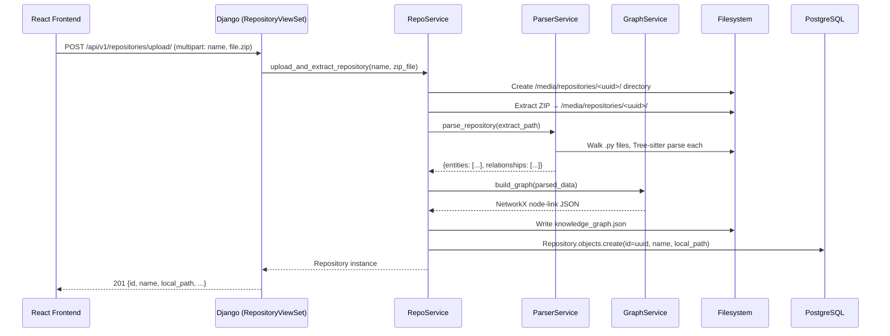
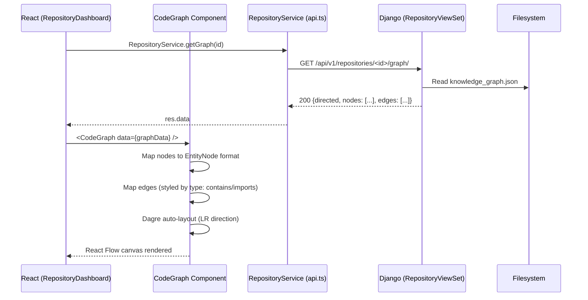
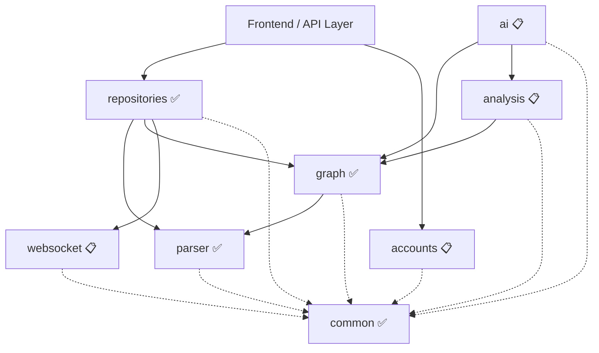

# CodeAtlas — System Architecture

> Last updated: **Phase 5 Complete** (July 2026)

This document defines the **Modular Monolith** architecture, Domain-Driven Design (DDD) principles, module boundaries, and coding standards for the CodeAtlas platform. It serves as the single source of truth for system design decisions.

---

## 1. High-Level Architecture

CodeAtlas follows a **Modular Monolith** pattern. All backend logic resides in a single Django application, partitioned into independent domain modules (Django apps) that communicate exclusively through service interfaces.

**Core Principles:**
- **High Cohesion, Loose Coupling**: Each module encapsulates its own domain logic, models, and services.
- **Service Layer Abstraction**: Modules interact *exclusively* via Service class methods — no cross-module ORM queries.
- **Single Source of Truth**: Data mutation for a domain happens only within that domain's services.

---

## 2. Current Project Folder Structure

```text
codeAtlas/
├── .gitignore
├── README.md
├── ARCHITECTURE.md               ← This file
│
├── frontend/                     ← React Application (Vite, TypeScript, Tailwind v4)
│   └── src/
│       ├── App.tsx               ← Router: / → Home, /repository/:id → Dashboard
│       ├── main.tsx
│       ├── index.css
│       ├── components/
│       │   ├── layout/           ← MainLayout (navbar wrapper, <Outlet />)
│       │   └── ui/               ← shadcn/ui generated components
│       ├── features/
│       │   └── graph/            ← ✅ ACTIVE: Graph visualization module
│       │       ├── CodeGraph.tsx ←   Fetches data → dagre layout → ReactFlow canvas
│       │       └── nodes/
│       │           └── EntityNode.tsx ← Custom node: icon + filename + path
│       ├── pages/
│       │   ├── Home.tsx          ← Repository list + ZIP upload form
│       │   └── RepositoryDashboard.tsx ← Graph loader + CodeGraph renderer
│       └── services/
│           └── api.ts            ← Axios instance + RepositoryService
│
└── backend/                      ← Django Application Root
    ├── .env                      ← Secrets (git-ignored)
    ├── manage.py
    ├── config/                   ← Django project configuration
    │   ├── settings.py           ←   Single settings file (dev)
    │   ├── urls.py               ←   Root router → /api/v1/repositories/
    │   ├── asgi.py
    │   └── media/
    │       └── repositories/
    │           └── <uuid>/       ←   Extracted ZIP + knowledge_graph.json
    └── apps/                     ← Domain Modules (bounded contexts)
        ├── common/               ← ✅ Shared exceptions, base classes
        ├── repositories/         ← ✅ ACTIVE: Full CRUD + upload + graph endpoint
        ├── parser/               ← ✅ ACTIVE: Tree-sitter AST extraction
        ├── graph/                ← ✅ ACTIVE: NetworkX graph builder
        ├── accounts/             ← 📋 Planned (Phase 7): Auth & user management
        ├── ai/                   ← ✅ ACTIVE: Gemini AI queries
        ├── analysis/             ← 📋 Planned: Code metrics & pattern detection
        └── websocket/            ← 📋 Planned (Phase 6): Real-time events
```

---

## 3. Backend Modules & Responsibilities

Each app in `backend/apps/` represents a bounded context with strict ownership of its data.

| Module | Status | Responsibility | Key Services | Allowed Dependencies |
|:---|:---|:---|:---|:---|
| **`common`** | ✅ Active | Shared base classes, `CodeAtlasException` | `CodeAtlasException` | None |
| **`repositories`** | ✅ Active | ZIP upload (50MB limit, Zip Slip protected), extraction, repo metadata, graph API | `RepoService` | `parser`, `graph`, `common` |
| **`parser`** | ✅ Active | Tree-sitter AST traversal, entity & relationship extraction | `ParserService` | `common` |
| **`graph`** | ✅ Active | NetworkX graph construction, `knowledge_graph.json` persistence | `GraphService` | `common` |
| **`accounts`** | 📋 Phase 7 | Auth, user profiles, API key management | `AuthService`, `UserService` | `common` |
| **`ai`** | ✅ Active | Gemini API orchestration (lazy cached model), NL code queries (rate-limited 15/hr) | `AIService` | `graph`, `analysis`, `common` |
| **`analysis`** | 📋 Planned | Graph algorithms, complexity, metrics | `MetricsService` | `graph`, `parser`, `common` |
| **`websocket`** | 📋 Phase 6 | WebSocket channel broadcasts | `NotificationService` | `common` |

---

## 4. Data Flow — Repository Upload Pipeline

This is the primary end-to-end flow currently implemented.



---

## 5. Data Flow — Graph Visualization



---

## 6. Module Dependency Diagram



### Strict Dependency Rules

1. **Downward Flow Only**: Modules can only depend on modules below them in the hierarchy. (e.g., `repositories` can call `parser`, but `parser` **cannot** call `repositories`)
2. **Service Abstraction**: A module cannot directly query another module's ORM models.
   - ❌ *Violation*: `ai.views` runs `CodeNode.objects.filter(...)`
   - ✅ *Correct*: `ai.services` calls `parser.services.ParserService.parse_repository(...)`
3. **`common` is Universal**: The `common` module cannot import from any other domain module.

---

## 7. API Contract

### Currently Implemented Endpoints

Base path: `/api/v1/`

```
GET    /repositories/                  → List all repos (metadata only)
POST   /repositories/upload/           → Upload ZIP, run full pipeline
GET    /repositories/<uuid>/           → Get single repo metadata
DELETE /repositories/<uuid>/           → Delete repo record
GET    /repositories/<uuid>/graph/     → Serve knowledge_graph.json

### AI Queries

```
POST   /ai/query/                      → Query Gemini AI with graph context
```

### `knowledge_graph.json` Schema

The graph is persisted and served in NetworkX **node-link format**:

```json
{
  "directed": true,
  "multigraph": false,
  "graph": {},
  "nodes": [
    {
      "id": "src/utils.py",
      "type": "file",
      "name": "src/utils.py"
    },
    {
      "id": "src/utils.py:MyClass",
      "type": "class",
      "name": "MyClass",
      "file_path": "src/utils.py"
    },
    {
      "id": "src/utils.py:helper_fn",
      "type": "function",
      "name": "helper_fn",
      "file_path": "src/utils.py"
    }
  ],
  "links": [
    {
      "source": "src/utils.py",
      "target": "src/utils.py:MyClass",
      "type": "contains"
    },
    {
      "source": "src/utils.py",
      "target": "os",
      "type": "imports"
    }
  ]
}
```

**Node types:**
| Type | ID format | Description |
|---|---|---|
| `file` | `relative/path/to/file.py` | Python source file |
| `class` | `relative/path.py:ClassName` | Class definition |
| `function` | `relative/path.py:func_name` | Function or method definition |

**Edge types:**
| Type | Meaning | Visual style |
|---|---|---|
| `contains` | File contains a class or function | Slate gray, solid |
| `imports` | File imports a module | Indigo, animated dashed |

---

## 8. Frontend Component Architecture

```
App.tsx
└── BrowserRouter
    └── MainLayout  (components/layout/MainLayout.tsx)
        ├── Navbar / Sidebar
        └── <Outlet />
            ├── Home.tsx  (route: /)
            │   ├── Repository list (GET /repositories/)
            │   └── Upload form (POST /repositories/upload/)
            └── RepositoryDashboard.tsx  (route: /repository/:id)
                ├── useEffect → GET /repositories/:id/graph/
                ├── Loading / Error states
                └── CodeGraph.tsx  (features/graph/CodeGraph.tsx)
                    ├── useNodesState / useEdgesState
                    ├── Dagre layout engine (LR direction)
                    └── ReactFlow
                        ├── EntityNode (nodes/EntityNode.tsx)
                        │   ├── Icon (file=blue, class=orange, fn=purple)
                        │   ├── Display name (basename only for files)
                        │   └── Path (directory or source file)
                        ├── Background (dot grid)
                        ├── Controls (zoom in/out/fit)
                        └── MiniMap
```

---

## 9. Development Conventions & Coding Standards

### 9.1 Naming Conventions

- **Python Folders/Packages**: `snake_case`
- **Python Files**: `snake_case` (e.g., `repo_service.py`, `models.py`)
- **Python Classes**: `PascalCase` (e.g., `CodeNode`, `ParserService`)
- **Python Functions/Variables**: `snake_case`
- **TypeScript Components**: `PascalCase` (e.g., `EntityNode`, `CodeGraph`)
- **TypeScript files**: `PascalCase` for components, `camelCase` for utilities

### 9.2 Module File Structure

Every module in `apps/` follows this structure:

```text
apps/<module_name>/
├── __init__.py
├── apps.py           # Django App Config
├── models.py         # ORM definitions
├── services.py       # Core Business Logic ← ALL logic lives here
├── serializers.py    # DRF Serializers
├── views.py          # HTTP Endpoints (thin: validate → call service → return)
├── urls.py           # Route definitions
└── tests/            # Module-specific test suite
```

### 9.3 Error Handling Strategy

- **Base Exception**: `common/exceptions.py` → `CodeAtlasException`
- **Domain Exceptions**: Each module defines typed exceptions (e.g., `RepositoryNotFound(CodeAtlasException)`)
- **JSON Response format:**
  ```json
  {
    "error_code": "REPOSITORY_NOT_FOUND",
    "message": "The requested repository does not exist.",
    "status": 404
  }
  ```

### 9.4 No Logic in Views

Views should only:
1. Parse & validate the HTTP request
2. Call the appropriate Service method
3. Return the serialized response

---

## 10. Phase Completion Summary

| Phase | What Was Built |
|---|---|
| **Phase 1** | Vite + React + TypeScript + Tailwind v4 + Django + PostgreSQL + .env + CORS |
| **Phase 2** | Domain module scaffold (8 apps), DRF router, REST viewsets, React Router, `Home.tsx`, `RepositoryDashboard.tsx` |
| **Phase 3** | `ParserService` (Tree-sitter, manual AST traversal), `GraphService` (NetworkX), `RepoService.upload_and_extract_repository()`, ZIP endpoint |
| **Phase 4** | `GET /repositories/<id>/graph/` endpoint, `RepositoryService.getGraph()`, `CodeGraph.tsx` with Dagre LR layout, `EntityNode` with filename + path display |
| **Phase 5** | Gemini AI integration, `AIService` query processing, `POST /ai/query/` endpoint, AI Assistant Side Panel in frontend |
| **Phase 5 (Hardened)** | Security fixes (Zip Slip, 50MB upload limit), DRF rate limiting (`AIQueryAnonThrottle`, `AIQueryUserThrottle`), lazy Gemini model caching, PostgreSQL database env mapping, chat history panel UX, dynamic repo list on Home page |

---

*Built with ❤️ using Django, React, Tree-sitter, NetworkX, and React Flow.*
