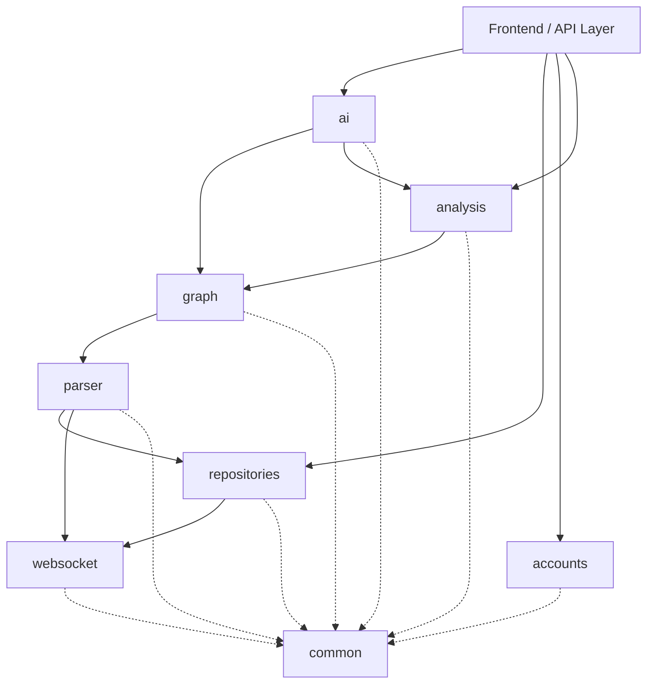

# CodeAtlas - Phase 2: System Architecture & Backend Foundation

This document defines the **Modular Monolith** architecture, Domain-Driven Design (DDD) principles, and coding standards for the CodeAtlas platform. It serves as the single source of truth for the backend foundation.

---

## 1. High-Level Architecture

CodeAtlas follows a **Modular Monolith** pattern. All backend logic resides in a single Django application, but the codebase is strictly partitioned into independent domain modules (Django apps). 

**Core Principles:**
- **High Cohesion, Loose Coupling**: Modules encapsulate their own domain logic.
- **Service Layer Abstraction**: Modules interact *exclusively* via Service interfaces, not by importing each other's ORM models or internal utilities.
- **Single Source of Truth**: Data mutation for a specific domain happens only within that domain's services.

---

## 2. Project Folder Structure

The repository is structured to separate Django configuration from domain logic, and web concerns from core processing engines.

```text
codeAtlas/
├── backend/                  # Django Application Root
│   ├── config/               # Django project configuration (replaces standard 'core')
│   │   ├── settings/
│   │   │   ├── __init__.py
│   │   │   ├── base.py       # Shared settings (Installed apps, middleware)
│   │   │   ├── local.py      # Development settings (Debug, local DB)
│   │   │   └── production.py # Production settings (Security, allowed hosts)
│   │   ├── asgi.py           # Daphne / WebSocket entrypoint
│   │   ├── wsgi.py           # Standard HTTP entrypoint
│   │   └── urls.py           # Root URL routing
│   │
│   ├── apps/                 # Domain Modules (Django Apps)
│   │   ├── accounts/         # User & Auth Domain
│   │   ├── repositories/     # Git Repository Domain
│   │   ├── parser/           # Tree-sitter AST Domain
│   │   ├── graph/            # NetworkX Graph Domain
│   │   ├── analysis/         # Code Metrics Domain
│   │   ├── ai/               # Gemini AI Domain
│   │   ├── websocket/        # Real-time Events Domain
│   │   └── common/           # Shared Utilities & Base Classes
│   │
│   ├── manage.py
│   └── .env
│
├── frontend/                 # React Application (Vite, TypeScript, Tailwind v4)
│
├── parser_engine/            # Language-specific Tree-sitter binaries and schemas (Decoupled from web layer)
├── repositories_storage/     # Local disk storage for cloned repositories
└── docs/                     # Architectural Decision Records (ADRs) and documentation
```

---

## 3. Backend Modules & Responsibilities

Each app in `backend/apps/` represents a bounded context.

| Module | Responsibility | Data Owned | Exposed Services | Allowed Dependencies |
|:---|:---|:---|:---|:---|
| **`accounts`** | Authentication, user profiles, session management. | `User`, `Profile`, `APIKey` | `AuthService`, `UserService` | `common` |
| **`repositories`** | Git cloning, syncing, managing repo metadata and branch state. | `Repository`, `Branch`, `Commit` | `RepoService`, `SyncService` | `accounts`, `websocket`, `common` |
| **`parser`** | Wraps Tree-sitter. Extracts AST, functions, classes, and imports. | `ParsedFile`, `CodeNode`, `ImportMap` | `ParsingService`, `ASTQueryService` | `repositories`, `common` |
| **`graph`** | Builds and queries NetworkX knowledge graphs from parsed data. | `GraphEdge`, `GraphNode`, `GraphSnapshot` | `GraphBuilderService`, `TraversalService` | `parser`, `common` |
| **`analysis`** | Runs algorithms on graphs to find complexity, metrics, and patterns. | `AnalysisReport`, `MetricScore` | `MetricsService`, `PatternService` | `graph`, `parser`, `common` |
| **`ai`** | Orchestrates Gemini API calls, manages prompts, Context Windows. | `AIQuery`, `AIResponse`, `PromptTemplate`| `AIQueryService`, `ContextService` | `graph`, `analysis`, `common` |
| **`websocket`** | Manages WebSocket connections and channel broadcasts. | None (Ephemeral State) | `NotificationService` | `common` |
| **`common`** | Base models, shared exceptions, global utilities. | None | `LoggingService`, Base Classes | None |

---

## 4. Module Dependency Diagram & Rules



### Strict Dependency Rules:
1. **Downward Flow**: Modules can only depend on modules below them in the architectural hierarchy. (e.g., `ai` can call `graph`, but `graph` **cannot** call `ai`).
2. **Service Abstraction**: A module cannot query another module's database models directly. 
   - *Violation*: `ai.views` runs `CodeNode.objects.filter(...)`
   - *Correct*: `ai.services` calls `parser.services.ASTQueryService.get_nodes(...)`
3. **Common is Universal**: The `common` module cannot import from any other domain module to prevent circular dependencies.

---

## 5. Development Conventions & Coding Standards

### 5.1 Naming Conventions
- **Folders/Packages**: `snake_case` (e.g., `parser_engine`, `repositories`)
- **Python Files**: `snake_case` (e.g., `repo_service.py`, `models.py`)
- **Classes**: `PascalCase` (e.g., `CodeNode`, `ASTQueryService`)
- **Functions/Variables**: `snake_case` (e.g., `sync_repository()`, `node_id`)
- **Constants**: `UPPER_SNAKE_CASE` (e.g., `MAX_RETRY_ATTEMPTS`)

### 5.2 Folder Structure per Module
Every module in `apps/` must follow this structure:
```text
apps/<module_name>/
├── __init__.py
├── apps.py           # Django App Config
├── models.py         # ORM definitions (Data Layer)
├── services.py       # Core Business Logic (Service Layer) 
├── selectors.py      # Complex Database Queries (Optional, keeps services thin)
├── serializers.py    # DRF Serializers (Presentation Layer)
├── views.py          # HTTP Endpoints (Presentation Layer)
├── urls.py           # Route Definitions
└── tests/            # Module-specific test suite
```

### 5.3 Error Handling Strategy
- **Base Exception**: Create a `CodeAtlasException` in `common/exceptions.py`.
- **Domain Exceptions**: Each module defines its own exceptions inheriting from the base (e.g., `RepositoryNotFound(CodeAtlasException)`).
- **Global Exception Handler**: Configure Django REST Framework to catch `CodeAtlasException` and map it to a standardized JSON response:
  ```json
  {
    "error_code": "REPOSITORY_NOT_FOUND",
    "message": "The requested repository does not exist or access is denied.",
    "status": 404
  }
  ```

---

## 6. Django Configuration Strategy

Settings are split into three environments:

1. **`base.py`**: Contains universal settings.
   - `INSTALLED_APPS` (Core apps + custom apps)
   - `MIDDLEWARE` (CORS, Security, Sessions)
   - `LOGGING` (Structured JSON logging for services)
2. **`local.py`**: Used for local development.
   - `DEBUG = True`
   - Local PostgreSQL & Redis URLs loaded from `.env`.
   - `CORS_ALLOWED_ORIGINS` mapped to `http://localhost:5173`.
3. **`production.py`**: Secure settings for deployment.
   - `DEBUG = False`
   - Strict `ALLOWED_HOSTS` and CORS policies.
   - Static/Media files configured for S3 or WhiteNoise.

---

## 7. Best Practices for a Three-Developer Team

1. **Feature Branching**: Use `feature/<module>-<brief-desc>` (e.g., `feature/parser-ast-extraction`).
2. **Pull Requests (PRs)**:
   - Require at least 1 approval before merging into `main`.
   - PRs must strictly adhere to the Service Layer boundaries (Reviewers must reject direct model access across modules).
3. **Automated Formatting & Linting**: 
   - Enforce **Ruff** for linting/formatting and **Mypy** for type checking.
   - Run via pre-commit hooks to avoid formatting arguments.
4. **API Contracts First**: Before implementing a feature, backend and frontend devs agree on the JSON request/response format and document it.
5. **No Logic in Views**: Views should only: (1) Validate input, (2) Call a Service, (3) Return the serialized Service response.
